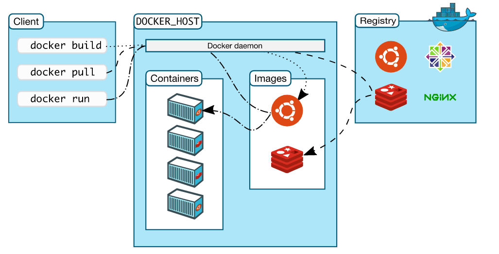

# Docker Architecture



Comunication between docker client and deamon is throw a REST api. Both client and deamon can run in the same system. Docker uses a technology called namespaces to provide isoleted workspace (container). 

# Name space
When a container runs, docker creates a set of namespaces for the docker container. A name space provides a layer of isolation. Each aspect of a containers runs in a separete namespace and its access is limeted by the namespace.

## Docker client
Is the console available to execute commands to interact with docker. This commands uses docker API. A client can communicate with many deamons.

## Docker registries
Stores docker images (Docker hub is a public registry). Is is possible to run it on your own private registry. Basically is place where images lives.

## Deamon
Is in charge of:
- listening API Request that coms from the client.
- A deamon can also comunicate with another deamos to manage docker services.
- Manage docker object. Docker objects are:
1. Images: is a read only template with instructions to create docker Container. A docker image is created by  using a dockerfile which create a layer in the image. 
2. Containers: Is a runnable instance of an image. Can create start stop, move or delete container using the docker API of the docker client (that uses docker API). A container can be connected to one or more networks, it is even possible create a new image based on its current state. When a container is removed any change on its state disappears beacause its state is not stores on any persistent storage. This is a dcker run command example: ``` docker run -i -t containerName /bin/bash ```
3. Volumes

## Best Practices
- Keep images small; less packageds lees propence to me insecure

## Common commands
- docker image push
- docker image pull
- docker iage inspect
- docker history psweb


## How to build new Images
- Go to the root folder of your app
- Create dockerfile (Instructions for building images)
- build dockerfile ``` docker image build -t psweb . ```
- see generated images ``` docker image ls ```
- run container ``` docker container run -d --name web1 -p 8080:8080 psweb ```. web1: containerNamel psweb: imageName -d: background
- to inspect layer ``` docker image inspect psweb ```
- to run conainer with interactable terminal ``` docker container run -it imageName sh ```
-  to quit from the console ``` exit ``` - or click on ctrl + shift + q + p - exiting the app exits the container
- execute a command to docker container ``` docker container exec containerID command ```
- to make sleep to the container for one day``` docker container run -d imageName sleep 1d ```
- to stop container ``` docker container stop containerID ```
- to see all containers (stopped non stopped containers) ``` docker container ls -a ```
- to run container by has ``` docker container start containerID ```
- to see container running console ``` docker container exec -it containerID sh ```
- clean up container by removing them ``` docker container rm $(docker container ls -aq) -f ```
- inspect image ``` docker iamge inspect imageName ```

## Logging
- deamon logs , comes from the dimone 
- container apps log