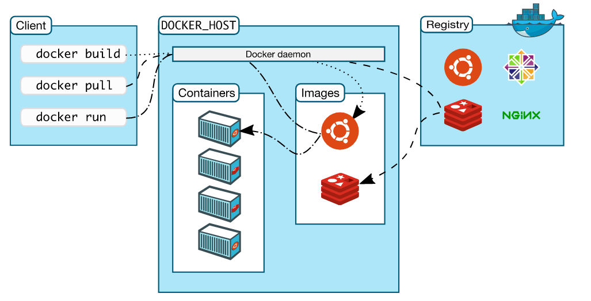

# Docker Architecture



Comunication between docker client and deamon is throw a REST api. Both client and deamon can run in the same system. Docker uses a technology called namespaces to provide isoleted workspace (container). 

# Name space
When a container runs, docker creates a set of namespaces for the docker container. A name space provides a layer of isolation. Each aspect of a containers runs in a separete namespace and its access is limeted by the namespace.

## Docker client
Is the console available to execute commands to interact with docker. This commands uses docker API. A client can communicate with many deamons.

## Docker registries
Stores docker images (Docker hub is a public registry). Is is possible to run it on your own private registry.

## Deamon
Is in charge of:
- listening API Request that coms from the client.
- A deamon can also comunicate with another deamos to manage docker services.
- Manage docker object. Docker objects are:
1. Images: is a read only template with instructions to create docker Container. A docker image is created by  using a dockerfile which create a layer in the image. 
2. Containers: Is a runnable instance of an image. Can create start stop, move or delete container using the docker API of the docker client (that uses docker API). A container can be connected to one or more networks, it is even possible create a new image based on its current state. When a container is removed any change on its state disappears beacause its state is not stores on any persistent storage. This is a dcker run command example: ``` docker run -i -t containerName /bin/bash ```
3. Volumes
