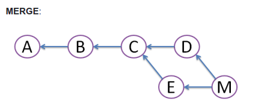
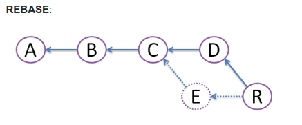

# Difference between Git Rebase and Git Merge

The idea of both is join changes between branches, but you may now that already and as me you could be asking, What is the difference? 

The difference is simple. - When you merge 2 branches. A new commit is been created, forming a poligonal git history graphic, someting like: 

Instead, rebasing 2 branches, moves your local commits to the head of the main branch, by removing the trace of previous commits. This keeps the git graphic history straight, is like changing the new end of the branch to make it be your branch, which looks like this:

See the points that comes to the 'E' node, those desapears from the git hitory. In summary, rebase makes more visible less confuse the action of reading git hitory.

# git merge --squash
It works like the rebase but keeping both branch commits history